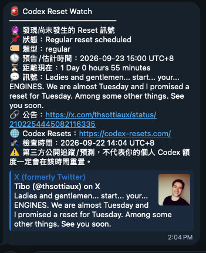
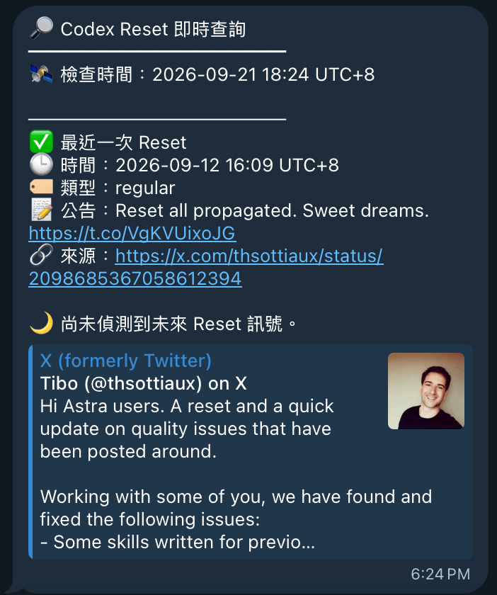
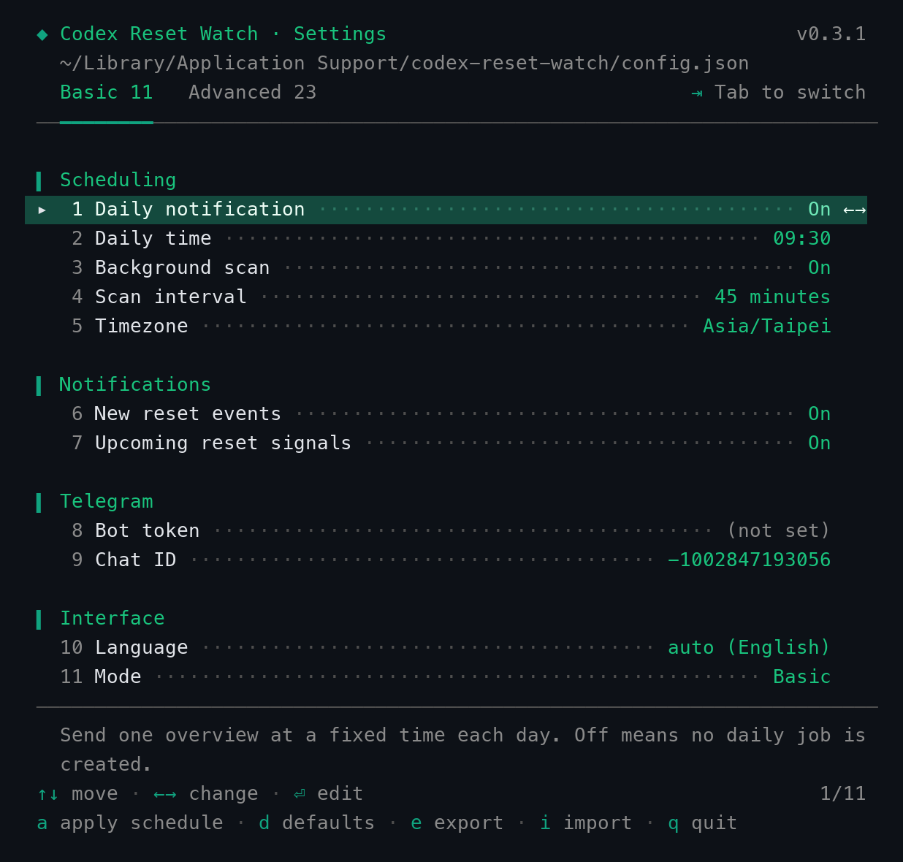

# Codex Reset Watch

Cross-platform (macOS/Linux/Windows) monitor for `codex-resets.com`, with Telegram notifications sent directly via the Bot API (`src/codex_reset_watch/telegram_notify.py`, stdlib-only).

When a public reset signal is found, `crw check` sends its status and type, estimated reset time
and countdown, source message and announcement link, Codex Resets link, and check time. The
notification also makes clear that this is a third-party public forecast: an individual Codex
quota may reset at a different time.

Example reset-signal notification:



Example Telegram configuration (`crw --config`):



Everything is tuned through one keyboard-driven menu, `crw config`. It opens on the **Basic**
tab (the settings most people touch); `Tab` switches to **Advanced** (every setting). Both tabs
are always on screen with their row counts, and the rule underlines the one you are on.
Full reference: [§4](#4-configuration-crw-config).



This version is **uv-native**:

- project/dependency metadata: `pyproject.toml`
- locked resolution: `uv.lock`
- preferred Python: `.python-version` (`3.13`)
- runtime: uv-managed Python
- installed CLI: `uv tool install`
- CLI entry points: `codex-reset-watch` and `crw`
- the OS scheduler calls the installed uv-tool executable directly; it does **not** depend on shell activation or `.venv`

Native OS scheduling backend, chosen automatically by `scripts/install.py`:

| OS | Scheduler | Renderer |
|---|---|---|
| macOS | `launchd` | `scripts/render_launchd.py` |
| Linux | `systemd --user` timers | `scripts/render_systemd.py` |
| Windows | Task Scheduler (`schtasks`) | `scripts/schtasks.py` |

## Installed paths

| Purpose | macOS | Linux | Windows |
|---|---|---|---|
| Config | `~/Library/Application Support/codex-reset-watch/config.json` | `$XDG_CONFIG_HOME/codex-reset-watch/config.json` (default `~/.config/...`) | `%APPDATA%\codex-reset-watch\config.json` |
| State | `~/Library/Application Support/codex-reset-watch/state.json` | `$XDG_STATE_HOME/codex-reset-watch/state.json` (default `~/.local/state/...`) | `%LOCALAPPDATA%\codex-reset-watch\state.json` |
| Logs | `~/Library/Logs/codex-reset-watch/` | `$XDG_STATE_HOME/codex-reset-watch/log/` | `%LOCALAPPDATA%\codex-reset-watch\Logs\` |
| Scheduler units | `~/Library/LaunchAgents/com.wes.codex-reset-watch.{daily,monitor}.plist` | `~/.config/systemd/user/codex-reset-watch-{daily,monitor}.{service,timer}` | Task Scheduler tasks `CodexResetWatchDaily` / `CodexResetWatchMonitor` |
| CLI | `~/.local/bin/{codex-reset-watch,crw}` | `~/.local/bin/{codex-reset-watch,crw}` | `%USERPROFILE%\.local\bin\{codex-reset-watch,crw}.exe` |

Resolution logic lives in `src/codex_reset_watch/paths.py` (defaults) and `config.py` (overrides).
Override any of the three with the env vars `CRW_CONFIG`, `CRW_STATE_DIR`, `CRW_LOG_DIR`, or set
state/log folder via `crw config` (the `state_dir`/`log_dir` settings — env vars win if both are
set). `CRW_CONFIG` has no config-file equivalent, since it names the config file itself.

> `~` is used in documentation and user-facing output. Scheduler job files/tasks contain expanded absolute paths — none of `launchd`/`systemd`/Task Scheduler expand `~`.

## 1. Install uv

If `uv` is already installed, skip this section.

macOS (Homebrew):

```bash
brew install uv
```

Linux/macOS (Astral's official installer):

```bash
curl -LsSf https://astral.sh/uv/install.sh | sh
```

Windows (PowerShell):

```powershell
powershell -ExecutionPolicy ByPass -c "irm https://astral.sh/uv/install.ps1 | iex"
```

Verify:

```bash
uv --version
```

## 2. Install Codex Reset Watch

One command, identical on macOS, Linux and Windows — run it from the extracted project folder.
The installer asks for your Telegram bot token and chat id interactively partway through (see
below); nothing needs to be exported beforehand.

```bash
uv run python scripts/install.py
```

That single command installs the CLI, puts it on your `PATH`, stores the Telegram credentials
and registers the OS scheduler — there is no separate step to forget. Then **open a new
terminal** (the `PATH` entry only applies to shells started afterwards) and verify:

```bash
crw doctor      # every line should be ✅
crw check       # first real run
```

`make install` / `make test` are thin wrappers over the same script, available on macOS and
Linux if you prefer them; Windows has no `make` and does not need it.

### Step 3: the Telegram prompt

```text
Set up Telegram notifications now?
  You'll need a bot token from @BotFather and the chat id it should message.
  Set up now? [Y/n]: y
  Telegram chat id: -1002847193056
  Telegram bot token (hidden):
  ✅ Saved. Bot token stored in macOS Keychain; chat id in ~/Library/Application Support/codex-reset-watch/config.json.
```

The token is typed **with echo off** — nothing appears on screen as you type it, the same way a
terminal hides a `sudo` password. This works identically on macOS, Linux and Windows because
it's one call to Python's standard `getpass` module rather than a hand-rolled `stty -echo` /
`read -s` script: `getpass` already knows how to suppress terminal echo on all three (via
`termios` on POSIX, `msvcrt` on Windows) and always restores it afterward, Ctrl-C included, with
no `trap`/cleanup code of our own to get wrong.

The prompt is skipped automatically — silently, so re-running the installer is a no-op here —
when either credential is already reachable (stored from a previous install, or set as
`TG_BOT_TOKEN`/`TG_CHAT_ID` in the environment) or when stdin isn't a terminal (CI, a piped
install: there's no one to answer it). Configure or change it anytime afterward with
`crw config` (see [§4](#4-configuration-crw-config)) or [§8](#8-telegram) for the environment-variable
alternative.

`scripts/install.py` also:

1. copies the project to `$CRW_INSTALL_DIR` (default `~/Documents/Workspace/codex-reset-watch`)
2. runs `uv python install 3.13`
3. installs the package as a persistent isolated uv tool
4. puts `codex-reset-watch` and `crw` in uv's own bin directory (`~/.local/bin`, or `$UV_TOOL_BIN_DIR`/`$XDG_BIN_HOME` if you set either) and runs `uv tool update-shell` so that directory is on the `PATH` of new shells
5. creates config/state/log directories
6. registers the native scheduler job for the current OS (launchd / systemd --user timers / Task Scheduler)
7. warns if anything else already answers to the name `crw` / `codex-reset-watch` — a shell
   alias or function in your startup files (`.zshrc`, `.bashrc`, fish config, PowerShell
   profile), or another executable earlier on `PATH`. Those win over step 4, so a leftover
   alias from an older setup makes `crw` fail with something like
   `zsh: no such file or directory: …/crw` even though the install succeeded. Delete the
   line the warning points at; don't add an alias of your own — step 4 already covers it.

Expected `uv tool list` entry:

```text
codex-reset-watch v0.1.0
- codex-reset-watch
- crw
```

## 3. Common commands

Immediate API check + terminal output + Telegram notification:

```bash
crw check
```

Alias of `check`:

```bash
crw update
```

Check without Telegram:

```bash
crw check --no-notify
```

Health check:

```bash
crw doctor
```

Recent logs:

```bash
crw logs -n 50
```

Force the daily path for testing:

```bash
crw daily --force
```

Run monitor path manually:

```bash
crw monitor
```

Adjust timing, notifications, Telegram, or paths (see [§4](#4-configuration-crw-config)):

```bash
crw config
```

Print the running version:

```bash
crw --version
```

### `--` is optional everywhere

Every subcommand may be written with or without leading dashes, and so may every one of its
flags. These pairs are identical:

| Either | Or |
|---|---|
| `crw config` | `crw --config` |
| `crw config --list` | `crw config list` |
| `crw config --set daily_time=09:00` | `crw config set daily_time=09:00` |
| `crw config --export ~/crw.json` | `crw config export ~/crw.json` |
| `crw check --no-notify` | `crw check no-notify` |
| `crw daily --force` | `crw daily force` |
| `crw logs --lines 50` | `crw logs lines 50` |

A bare word is only read as a flag after the subcommand that actually declares it, so
`crw config set export` still sets a key literally named `export`, and anything after a bare
`--` is passed through exactly as typed.

## 4. Configuration (`crw config`)

Every tunable value — whether the daily notification runs at all and at what time, how often the
background scan runs, notification toggles, Telegram credentials, API endpoints/timeouts,
interface language, and config/state/log folder locations — lives in one schema
(`src/codex_reset_watch/config.py`) and is editable without hand-editing JSON:

```bash
crw config                     # interactive menu (arrow keys)
crw config --list              # print current settings and exit
crw config --set scan_interval_minutes=45m --set daily_time=09:30
crw config --export ~/crw-settings.json    # portable backup, secrets excluded
crw config --import ~/crw-settings.json    # apply a backup, all-or-nothing
```

Remember that `--` is optional: `crw --config`, `crw config list` and `crw config export FILE`
all work too (see [§3](#--is-optional-everywhere)).

### The interactive menu

`crw config` with no flags opens a keyboard-driven menu on a real terminal:

| Key | Does |
|---|---|
| `↑` `↓` | move between rows |
| `←` `→` | change a toggle (On/Off) or step through a choice (Language) |
| `Enter` | toggle a switch, or open an inline editor for a typed value |
| `Esc` | cancel the current edit (or quit from the row list) |
| `Tab` | switch Basic ↔ Advanced mode (`m` in the numbered fallback menu) |
| `a` | apply the OS schedule now |
| `d` | restore every default (asks `y` to confirm) |
| `e` / `i` | export / import settings — type a path, `Enter` |
| `q` / `Ctrl-C` | quit |

The selected row is a full-width highlighted band marked with a `▸` cursor, and it ends in the
key that acts on it — `←→` when the row cycles, `⏎` when it opens an editor. That column is
reserved on every row, so moving the cursor never shifts the value column. While the menu waits
for a key, that cursor breathes: the glyph stays put and only its colour ramps up and down, so
the animation cannot move a column. It runs on a real terminal only — piped or redirected
output never animates, and stays plain text. The row's help text
appears below the list, and the bottom-right counter (e.g. `4/11` in Basic mode, `4/23` in
Advanced) says where you are; on a short terminal the list scrolls with `▴ N more` / `▾ N more`
markers rather than silently hiding rows.

Each change saves immediately, and a schedule-relevant change re-applies the OS schedule on
quit automatically. "Change" means the value actually differs from the one the schedule was
built from — re-typing the same time, or toggling a row off and back on, re-applies nothing.
The same holds for `crw config --set` (use `--apply-schedule` to force one).

### Basic and Advanced mode

The menu shows a curated **Basic** subset by default — the settings most people actually touch
(scheduling, notification toggles, Telegram, language). **Advanced** adds everything else: the
API/HTTP tuning and the storage-path rows.

Both modes sit in the header as two tabs, with how many rows each one holds, and the panel's
hairline thickens under the active one — so which view you are in, what the other one would
give you, and the key that gets you there are all on screen at once:

```text
   Basic 11   Advanced 23                                ⇥ Tab to switch
 ──━━━━━━━━──────────────────────────────────────────────────────────────
```

`Tab` switches (`m` in the numbered fallback menu, which shows a badge instead — there is no
key to press there). The underline marks the active tab even with `NO_COLOR` or piped output.
The choice is just another setting (`ui_mode`), so it is remembered across runs; a fresh
install starts in Basic — see the screenshot at the top of this README.

Colour is dropped whenever stdout isn't a real terminal or `NO_COLOR` is set. On the classic
`cmd.exe`/conhost window it stays on: the first colour print flips that console into ANSI mode
via `SetConsoleMode` (`ui._enable_windows_vt`), one-time and best-effort, so codes render instead
of printing literally. Windows Terminal and PowerShell already do this on their own.

### Input is constrained at the keystroke, not just validated on save

A field only accepts what it can legally hold, so an invalid value cannot be typed in the first
place — the schema check on commit is the backstop, not the first line of defence:

| Field kind | What the editor accepts |
|---|---|
| Time (`daily_time`) | Digits only; the `:` is inserted after the hour; a lone `9` becomes `09:`; an hour past 23 or a minute past 59 is refused as you type; stops at 4 digits |
| Interval (`scan_interval_minutes`) | Digits, then at most one unit (`m`/`h`/`d`) — `2h5` and `2hd` are impossible |
| Integers | Digits only, capped to as many digits as the maximum needs and clamped to it live (`99` in a 1–10 field shows `10`) |
| Choice (`language`) / toggles | Not typed at all — `←→` steps through the allowed values |
| Secret (`telegram_bot_token`) | Any character; opens empty, and committing it empty keeps the stored token |

While an editor is open, the help line shows the accepted format rather than the setting's
description — `HH:MM · digits only, the colon is added for you (00:00–23:59)`,
`Digits, then a unit: 30m · 2h · 1d`, `Whole number, 1–10`.

When stdin or stdout is not a terminal (a pipe, CI, a test), the same schema is served by a
numbered prompt instead — type the row number, `Enter` — so `crw config` never hangs waiting for
a keypress that cannot arrive.

`crw config --list` (values below are an example, not your real settings):

```text
 ◆ Codex Reset Watch · Settings                     Advanced mode v0.3.1
   ~/Library/Application Support/codex-reset-watch/config.json
 ────────────────────────────────────────────────────────────────────────

 ▍ Scheduling
    1 Daily notification ········································· On
    2 Daily time ·············································· 09:30
    3 Background scan ············································ On
    4 Scan interval ······································ 45 minutes
    5 Timezone ·········································· Asia/Taipei

 ▍ Notifications
    6 New reset events ··········································· On
    7 Upcoming reset signals ····································· On
    8 Notify on unchanged scan ··································· On
    9 Notify on unchanged day ···································· On

 ▍ Telegram
   10 Bot token ··········································· (not set)
   11 Chat ID ········································ -1002847193056

 ▍ API
   12 API base ····························· https://codex-resets.com
   13 status path ···································· /api/v1/status
   14 resets path ················ /api/v1/resets?limit=20&order=desc
   15 Timeout (seconds) ·········································· 15
   16 Retries ····················································· 3
   17 User-Agent ·· codex-reset-watch/1.0 (+https://codex-resets.com…

 ▍ Storage
   18 State folder ······························· (platform default)
   19 Log folder ································· (platform default)
   20 Log size cap ············································ 2 MiB
   21 Log backups ················································· 3

 ▍ Interface
   22 Language ······································· auto (English)
   23 Mode ···················································· Basic

 Times shown in Asia/Taipei; the OS fires each job in its own local time.
```

`--list` always shows the full (Advanced) schema, regardless of the stored mode — the badge and
`23 Mode` row make that explicit.

### Settings

| Setting | Meaning | Examples |
|---|---|---|
| `daily_enabled` | Run the daily notification at all | `on` / `off` |
| `daily_time` | Wall-clock time for the daily job | `10:00`, `9:30` |
| `monitor_enabled` | Run the background scan at all | `on` / `off` |
| `scan_interval_minutes` | How often the background scan runs — **min 1 minute, max 1 day** | `30m`, `2h`, `1d`, or a bare number of minutes |
| `timezone` | Timezone `daily_time` and rendered timestamps use | `UTC+8`, `UTC-05:30`, `UTC`, `local`, or an IANA name (`Asia/Taipei`) |
| `notify_new_reset_events` / `notify_upcoming_reset` | Which event types trigger a Telegram push | `on` / `off` |
| `monitor_notify_when_unchanged` / `daily_notify_when_unchanged` | Push even when nothing changed since last check | `on` / `off` |
| `telegram_bot_token` | Bot API token — **stored in the OS keychain, never in a file** (see [§8](#8-telegram)) | masked as `********WXYZ` |
| `telegram_chat_id` | Chat that receives notifications | `-1002847193056` |
| `api_base`, `status_path`, `resets_path` | codex-resets.com endpoints | — |
| `request_timeout_seconds`, `request_retries` | HTTP client tuning | — |
| `state_dir`, `log_dir` | Override the platform-default state/log folders | blank = platform default |
| `max_log_bytes`, `log_backups` | Application log rotation | — |
| `language` | Menu and message language | `auto`, `en`, `zh-TW` |
| `ui_mode` | Which settings `crw config` shows — Basic (curated) or Advanced (everything) | `basic`, `advanced` |

### Language

The menu, help text, validation errors and the `doctor` summary are available in English and
Traditional Chinese. `auto` (the default) follows the system locale — `zh_TW`, `zh_HK`, `zh_Hant`
and `zh_MO` resolve to 繁體中文, everything else to English. Pin it explicitly with:

```bash
crw config set language=zh-TW
```

`CRW_LANG=zh-TW crw config --list` overrides it for a single run without touching the config.

### Export and import

```bash
crw config export ~/crw-settings.json   # or `-` for stdout, to pipe it somewhere
crw config import ~/crw-settings.json
```

An export is a portable backup: it carries every declared **non-secret** setting and is written
`0600`. The bot token is filtered out by its schema kind, not by a hand-kept list, so a secret
added to the schema later cannot start leaking into export files by omission.

An import is all-or-nothing and reports what it refused:

- **Secrets are never imported.** An export has none, so a token in the file is either
  hand-written or a pasted mask — writing either would destroy the real token on this machine.
- **Unknown keys are left alone** rather than stored back as an unvalidated blob.
- **One invalid value aborts the whole import** before the first write, so a half-applied config
  can never be the outcome.

`crw config --set` validates every value the same way the menu does (rejects an out-of-range
interval, a malformed `HH:MM`, etc.) and reports which key failed. Changing any setting that
affects the OS scheduler (`daily_enabled`, `daily_time`, `monitor_enabled`,
`scan_interval_minutes`, `timezone`, `log_dir`) automatically re-renders and re-registers the
scheduler job(s) for the current OS on exit/save — the same effect as running:

```bash
crw apply-schedule
```

which you can also run directly any time (e.g. after editing `config.json` by hand). This is the
config-driven counterpart to `scripts/render_launchd.py` / `render_systemd.py` / `schtasks.py`,
which `scripts/install.py` also calls on first install — see [§7](#7-scheduler-jobs).

Config file location, in priority order: `$CRW_CONFIG`, else the platform default from the
[Installed paths](#installed-paths) table above. `config.example.json` documents every
file-backed key with its default value — the bot token is deliberately absent from it.

## 5. uv project commands

For development inside the project:

```bash
cd ~/Documents/Workspace/codex-reset-watch
uv sync
uv run crw --help
uv run crw check --no-notify
uv run python -m unittest discover -s tests -v
```

Inspect uv-managed tool locations:

```bash
uv tool list
uv tool dir
uv tool dir --bin
uv python list --only-installed
```

The installer deliberately installs into **uv's own default bin directory**, so the stable paths
used by launchd/systemd/Task Scheduler are:

```text
~/.local/bin/codex-reset-watch
~/.local/bin/crw
```

It used to override `UV_TOOL_BIN_DIR` to a private `~/scripts` instead, which silently broke the
scheduler: uv records each entrypoint's absolute path in its receipt and deletes the recorded
ones on every reinstall, so a later plain `uv tool install`/`uv tool upgrade` — run without that
same override — moved the CLI to `~/.local/bin` and left the scheduler jobs invoking a path that
no longer existed. Matching uv's default keeps the two in sync no matter how the tool is
reinstalled. `crw doctor`'s **Scheduled CLI** line asserts exactly this.

## 6. Reinstall after source changes

Recommended:

```bash
cd ~/Documents/Workspace/codex-reset-watch
make install
```

Or reinstall only the uv tool executable/environment:

```bash
cd ~/Documents/Workspace/codex-reset-watch
make tool-reinstall
```

`make install` (or `uv run python scripts/install.py` on Windows) is preferred when scheduler configuration or installer files also changed.

## 7. Scheduler jobs

Both the daily time and the monitor interval are read from config at render time (see [§4](#4-configuration-crw-config)) —
defaults below are what ships in `config.example.json`. Either job can also be turned off entirely
(`daily_enabled` / `monitor_enabled`), which removes its scheduler entry instead of leaving a
disabled stub. All rendering lives in `src/codex_reset_watch/scheduler.py`, shared by
`scripts/install.py` (first install) and `crw config` / `crw apply-schedule` (re-apply after a
settings change) — the per-OS scripts under `scripts/` are thin wrappers around it.

### Daily job

- default: 10:00, in the configured timezone (`timezone` setting; converted to the machine's own
  local time at render time, since every OS scheduler fires on system local time)
- runs immediately at login/boot too (`RunAtLoad`/`Persistent`), so a missed run (machine asleep/off) catches up
- Python-side daily gate (`last_daily_date` in state) prevents duplicate daily work even if the OS runs it more than once

### Monitor job

Runs every `scan_interval_minutes` (default 120 = every 2 hours; **min 1 minute, max 1440 = 1 day**),
as a rolling interval from when the job last fired — not a fixed set of wall-clock minutes.

The program uses a cross-platform file lock (`src/codex_reset_watch/filelock.py`) so overlapping daily/monitor invocations do not corrupt state or duplicate work.

### macOS — launchd

- `~/Library/LaunchAgents/com.wes.codex-reset-watch.daily.plist` (`StartCalendarInterval`)
- `~/Library/LaunchAgents/com.wes.codex-reset-watch.monitor.plist` (`StartInterval`, in seconds)
- installer/`crw apply-schedule` runs `launchctl bootout` (both, to clear a disabled job) then `bootstrap`/`enable` for each enabled job

### Linux — systemd --user timers

- `~/.config/systemd/user/codex-reset-watch-daily.{service,timer}` (`OnCalendar=*-*-* HH:MM:00`)
- `~/.config/systemd/user/codex-reset-watch-monitor.{service,timer}` (`OnBootSec=`/`OnUnitActiveSec=<N>min`)
- installer/`crw apply-schedule` runs `systemctl --user daemon-reload` then `enable --now` on each enabled timer (and `disable --now` a job that was just turned off)
- requires a systemd user instance (lingering, if you want jobs to run without an active login session: `loginctl enable-linger $USER`)

### Windows — Task Scheduler

- `CodexResetWatchDaily` (`/SC DAILY /ST HH:MM`)
- `CodexResetWatchMonitor`: `/SC HOURLY /MO <hours>` when the interval is a whole number of hours (e.g. the 2-hour default), `/SC MINUTE /MO <minutes>` otherwise, `/SC DAILY` for a full 1-day interval
- `TG_BOT_TOKEN`/`TG_CHAT_ID` are persisted with `setx` into your user environment rather than passed as task arguments, since `schtasks /query /v` output is not a safe place for secrets

## 8. Telegram

Sends directly through the Telegram Bot API via `telegram_notify.py` — no external script
dependency. There are two ways to supply the credentials, and what `crw config` stored wins.
The installer ([§2](#2-install-codex-reset-watch)) already walks through Option A on first
install with the token entered echo-off; this section is for setting it up later or changing it.

### Option A — configure them once (recommended)

```bash
crw config          # rows 10 and 11, under "Telegram"
```

or non-interactively:

```bash
crw config set telegram_bot_token=123456:ABC...
crw config set telegram_chat_id=-1002847193056
```

**The bot token is never written to a file.** It goes into the operating system's own credential
store, and the config file, exports, backups and screenshots never contain it:

| OS | Where the token is kept | Via |
|---|---|---|
| macOS | Keychain (`codex-reset-watch` generic password) | `security` |
| Linux | Secret Service — GNOME Keyring / KWallet | `secret-tool` (libsecret) |
| Windows | DPAPI, encrypted for your user account | PowerShell |
| none of the above | **nothing is stored** | — |

That last row is deliberate. With no credential store available, `crw` refuses to persist the
token rather than falling back to a plaintext file or to home-rolled obfuscation, and the menu
says so on the token row. Use Option B there.

Wherever it is displayed the token is masked (`********WXYZ`), it is never passed on a command
line (the credential helpers read it on **stdin**, so it cannot surface in `ps` or shell
history), and it is never written to the event log.

**Saving never deletes it.** Every other setting is persisted by rewriting the whole config, so
a save runs constantly — on each menu edit, each `--set`, each import. A save that is handed a
config *without* a token (a `DEFAULTS` dict, a briefly unreadable keychain, a partial config)
leaves the stored item exactly as it is; it is not read as "remove the credential". Restoring
defaults keeps the token for the same reason: a token has no default to restore *to*, only an
item to destroy. Removing one is an explicit act:

```bash
crw config --set telegram_bot_token=      # names the key, asks for it to be empty
```

Until that distinction existed, `make test` was enough to wipe the stored token — the suite
saves real configs, and a save with no token in it deleted the developer's own keychain item, so
the token had to be retyped after every release. See [§12](#12-tests).

If the token row is empty but notifications still work, `TG_BOT_TOKEN` is set in your
environment (Option B) and is being used; the row shows only what the keychain holds, and says
so.

To inspect or remove the stored item yourself on macOS:

```bash
security find-generic-password -s codex-reset-watch -a telegram_bot_token   # metadata only
security delete-generic-password -s codex-reset-watch -a telegram_bot_token
```

### Option B — environment variables

```bash
export TG_BOT_TOKEN="..."
export TG_CHAT_ID="..."
```

These fill in whatever Option A has not stored, each falling back independently, so an install
that only ever exported them keeps behaving exactly as before. They do **not** override a stored
value: a `TG_BOT_TOKEN` forgotten in a shell profile must not keep notifying through a bot you
already replaced in `crw config`.

For the same reason, the credentials are baked into the generated scheduler job (see
[§7](#7-scheduler-jobs)) **only on a machine with no credential store**. Everywhere else the
plist/unit carries no secret at all and every scheduled run reads the token from the store
itself — so changing it in `crw config` takes effect immediately, with no re-apply.

`crw doctor` reports which store is in use and where each credential came from, showing the
token masked:

```text
✅ Secret store: macOS Keychain
✅ Telegram bot token: ********QrSt (macOS Keychain)
✅ Telegram chat id: -1002847193056 (environment)
```

Then:

```bash
crw check
```

## 9. Timezone and countdown

Upcoming reset information is rendered in the configured `timezone` (default `UTC+8` — see
[§4](#4-configuration-crw-config)) and includes remaining time with:

- maximum unit: Day
- minimum unit: minutes

Example:

```text
🕒 預測窗口截止：2026-09-21 23:09 UTC+8
⏳ 距離現在：2 Days 1 hour 35 minutes
```

## 10. Event parsing resilience

`event_from_dict` tolerates upstream API schema drift instead of assuming one fixed shape:

- Timestamp and source-URL keys match both `snake_case` and `camelCase` variants
  (`created_at`/`createdAt`, `source_url`/`sourceUrl`, etc.), searched up to 3 levels deep so a
  nested `source: {url: ...}` object resolves correctly.
- If no timestamp field is present or parseable, the event ID or source URL is checked for an
  embedded X/Twitter Snowflake post ID, which encodes its own creation time. This keeps
  historical reset times available even if the upstream schema changes or omits its timestamp
  field. API-provided timestamps always take priority over this fallback.

## 11. Logs and disk usage

Application logs:

```text
~/Library/Logs/codex-reset-watch/events.jsonl
~/Library/Logs/codex-reset-watch/api.jsonl
```

Default config limits each rotated application/API log to roughly 2 MiB with 3 backups:

```json
{
  "max_log_bytes": 2097152,
  "log_backups": 3
}
```

launchd stdout/stderr logs are separately trimmed to 256 KiB by the installer when they exceed 512 KiB (macOS only — `install.trim_launchd_logs`). systemd/journald and Windows Task Scheduler manage their own job-output retention.

## 12. Tests

Run everything through uv (macOS/Linux):

```bash
make test
```

Windows:

```powershell
uv run python -m unittest discover -s tests -t . -v
```

Individual groups (macOS/Linux):

```bash
make test-unit
make test-integration
```

The integration tests (`tests/test_integration.py`, `tests/test_run_check.py`, `tests/test_cli_config.py`, `tests/test_cli_syntax.py`, `tests/test_install_telegram.py`) start a local HTTP server and exercise the real HTTP client, response normalization, and `run_check`/`crw config`/installer-prompt flows without contacting the production API or a real terminal. The full suite runs unmodified on macOS, Linux, and Windows in CI (see `.github/workflows/ci.yml`).

Three families of side effect are mocked everywhere, for the same reason — a unit test must not touch what this machine actually has:

- **The OS scheduler.** Every test that exercises `crw config` / `crw apply-schedule` mocks `scheduler.apply` (`tests/test_ui.py`, `tests/test_ui_menu.py`, `tests/test_cli_config.py`, `tests/test_cli_syntax.py`). The scheduler *rendering* logic itself (`tests/test_scheduler.py`, `tests/test_launchd.py`, `tests/test_systemd.py`) is exercised fully, always against a throwaway output directory.
- **The credential store.** `tests/__init__.py` closes the OS boundary for the whole suite: the backend probe reports "no credential store" and `secrets_store._run` raises if anything still tries to shell out. Nothing else in the suite can reach the machine's real keychain — which it used to, every run, deleting the developer's own bot token. `tests/test_secrets_store.py` replaces the single subprocess funnel, so the macOS, Linux and Windows code paths are all covered on whatever machine runs the suite. `RoundTripTests` is the one deliberate exception: it lifts that fence (`tests.real_credential_store`) to store and re-read a throwaway `_roundtrip_probe` item in the machine's real credential store — its own account name, never the real token — deleted again in cleanup, and skipped where there is no store. Mocking that funnel is precisely what once hid an inert write — `add-generic-password -w` prompts `/dev/tty` rather than reading stdin, so it stored nothing and still exited 0 while every mocked assertion passed. A contract test cannot catch a tool ignoring the contract.
- **The terminal.** The keyboard menu's brain (`ui.step`) is a pure function of state and keypress, so `tests/test_ui_menu.py` drives the whole interaction with synthetic `KeyEvent`s, and `tests/test_keys.py` feeds raw escape-sequence bytes through a fake byte source — no TTY, no raw mode, nothing to restore.

Language-dependent assertions always pin the language explicitly (`lang="en"` / `CRW_LANG=zh-TW`), so the suite gives the same result on a machine with any locale.

## 13. Scheduler status

macOS:

```bash
make launch-status
# or
launchctl print gui/$(id -u)/com.wes.codex-reset-watch.daily
launchctl print gui/$(id -u)/com.wes.codex-reset-watch.monitor
```

Linux:

```bash
systemctl --user status codex-reset-watch-daily.timer codex-reset-watch-monitor.timer
systemctl --user list-timers 'codex-reset-watch-*'
```

Windows:

```powershell
schtasks /Query /TN CodexResetWatchDaily /V /FO LIST
schtasks /Query /TN CodexResetWatchMonitor /V /FO LIST
```

## 14. Uninstall

macOS/Linux:

```bash
cd ~/Documents/Workspace/codex-reset-watch
make uninstall
```

Windows:

```powershell
uv run python scripts/uninstall.py
```

This removes the scheduler job(s) for the current OS and uninstalls the uv tool. Project files, config, state, and logs are intentionally retained (path printed by the uninstaller).

## 15. CI notifications

`.github/workflows/ci.yml` runs the test matrix (macOS/Linux/Windows) on every push and PR, then a separate `notify-telegram` job sends a Telegram message only when the test job fails on a `push` (never on green runs, never on `pull_request`, to avoid pinging on forks/external PRs). Configure it once per repo:

```bash
gh secret set TELEGRAM_BOT_TOKEN
gh secret set TELEGRAM_CHAT_ID
```

Both are independent of this project's own runtime `TG_BOT_TOKEN`/`TG_CHAT_ID` — the CI ones only ever see a failure alert with the repo/branch/commit and a link to the run; they never touch the app's monitoring data.

## Why the installer does not call `uv run` for scheduled jobs

`uv run` is ideal for project development because it discovers the project, syncs the project environment when needed, and executes within that environment. For a long-running background setup, this project instead installs the CLI with `uv tool install` and lets the OS scheduler call the installed executable directly. That keeps each scheduled invocation small and avoids depending on the current working directory, shell startup files, PATH activation, or project `.venv` state.
